# 0. Getting Started

This section initializes the development environment and explains how you can make changes to the code and execute tests.

## Prerequisites

- [x] AWS Account including Admin Access → https://console.aws.amazon.com/console/home
- [x] Amazon Account for Alexa Skillbuilder Access → https://developer.amazon.com/de/alexa/
- [x] preferably Google Chrome

## Step 0 - Region IRELAND

Logon to the AWS console and switch to region **IRELAND** (eu-west-1)!

## Step 1 - Create Project

Launch Service "CodeStar" and select "create a new project".  
Choose the "Hello World Skill - NodeJS Alexa Lambda" template:

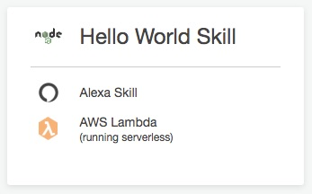

Choose desired project name e.g. alexa-hana-playground.  
Make sure AWS CodeCommit is chosen as code repository.  
Make sure to connect your AWS Account to the Amazon Developer Account (Alexa Skillbuilder)!

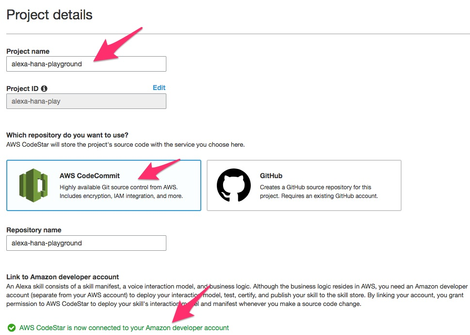

Click "Next" and chose AWS Cloud9

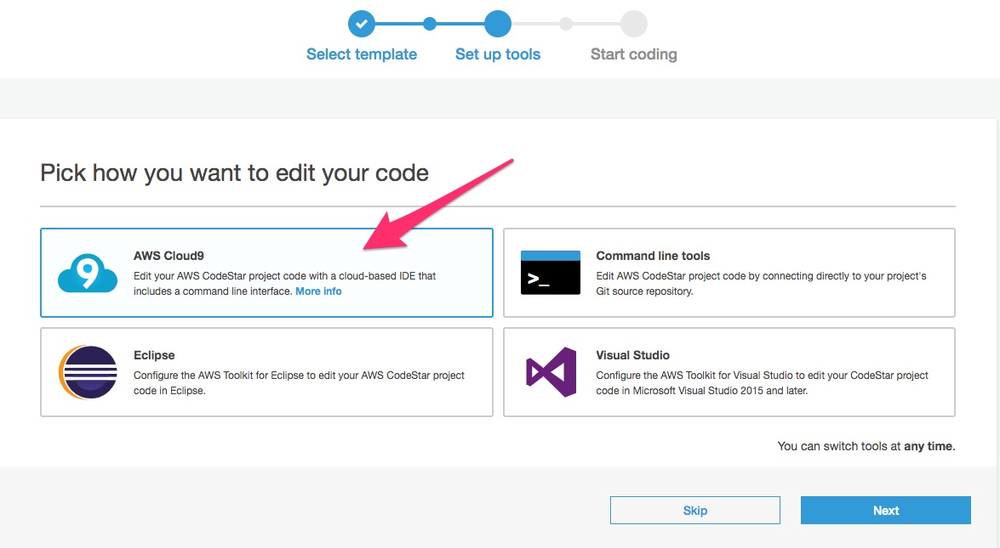

Finish wizard (defaults apply, no further changes required).  
It can take up to 5 min until the environment is ready, please be patient.
An initial pipeline run will be executed to deploy the full stack incl. skill.

## Step 2 - Logon to IDE (Cloud9)

Once your environment is fully ready, logon to your Cloud9 IDE.

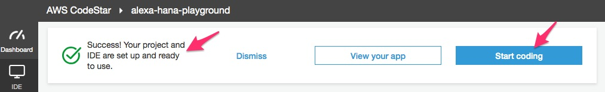

Familarize with the environment and then switch to the correct working directory via the console

```bash
$ cd /home/ec2-user/environment/alexa-hana-play
```

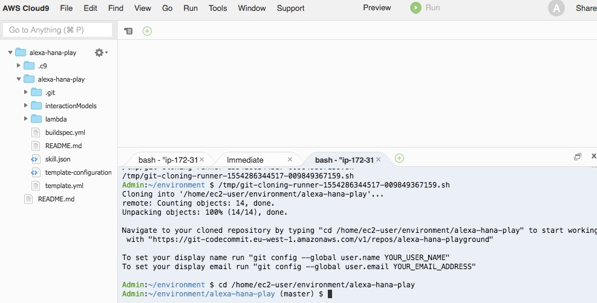

## Step 3 - Test Skill
Logon to [Amazon Developer Account](https://developer.amazon.com/alexa/console/ask) (Alexa Skillbuilder)  
Locate your skill "hello node" and press "Edit"

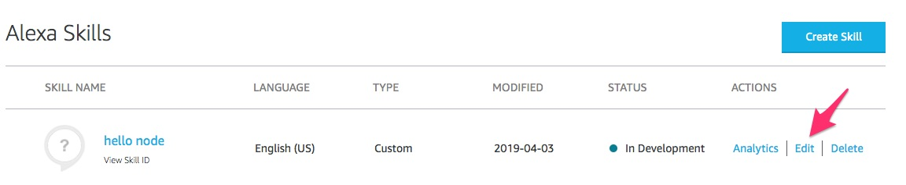

In the "Build" tab, locate the **Skill Invocation Name**.  
Switch to the "Test" tab, use the dropdown to select "Development" and use the **Skill Invocation Name** to active the skill.  
Familiarize with the skill model ("Build" tab) and try out different inputs (voice or text) again in tab "Test".

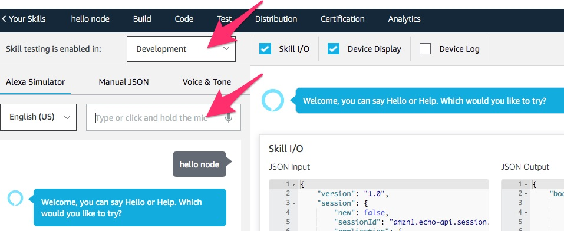

## Step 4 - Rename Skill and change welcome text

In Codestar - Inspect Pipeline, go to CodeDeploy and adjust Deployment Group → Lambda all at Once, to speed up deployment. Save!

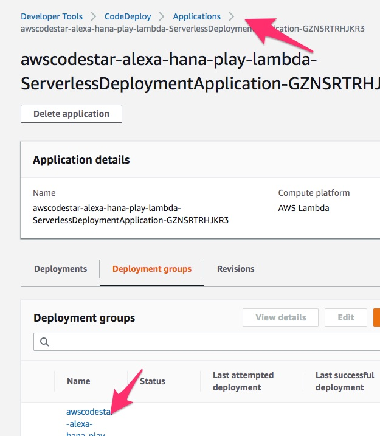

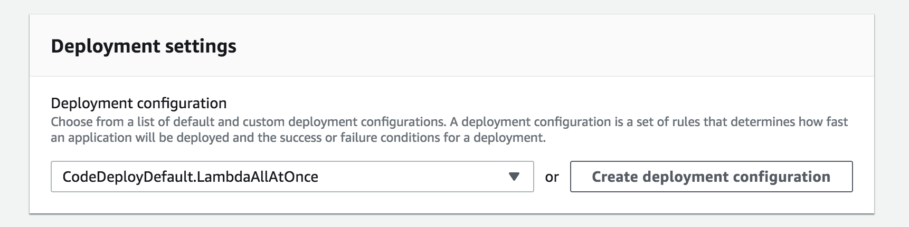

In Cloud9, open the **skill.json** file and change the skill name e.g. hello hana playground. Make sure to save the file!

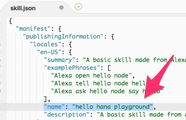

Open the **index.js** lambda code and find the welcome text. Make some changes! Make sure to save the file!

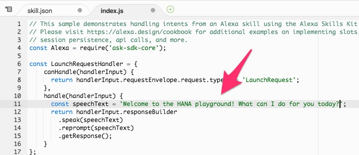

Now push changes, by executing the following code snippets in the console sequentially

```bash
$ git add *
$ git commit -m 'update skill name & welcome text'
$ git push origin master
```

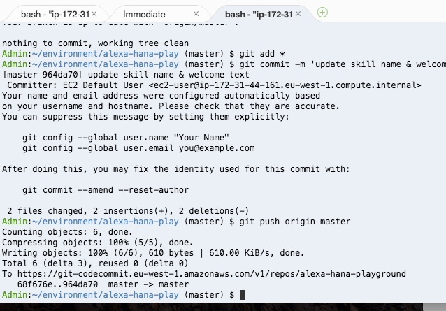

See how changes are propagated through the pipeline, which can take a couple of minutes. Once completed, test your skill again via the skillbuilder -> "Test" tab = Alexa Skill Simulator.  
You might need to refresh the page.

## Step 5 - Test Lambda via Cloud9

In order have a faster development cycle, let's see how we can test our code directly in Cloud9.

Go back to the Skillbuilder "Test" tab and run a test.  
Copy the test payload in the left pane to your clipboard.  

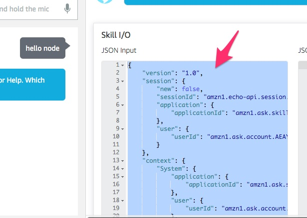

Go back to Cloud 9.
Create a .gitignore file in the project folder and add a line "node_modules".

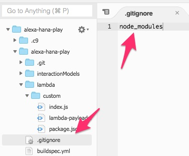

Go to the console and execute the following commands to install runtime dependencies
```bash
$ cd lambda
$ cd custom
$ npm install
$ cd ..
$ cd ..
```

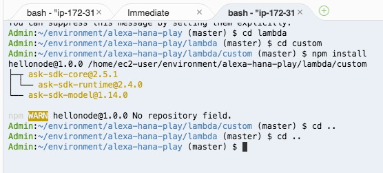

Open the AWS Resources pane.  
Press the run button once, paste the previously copied payload into the textarea and hit run again. You should now be able to see a successful output.

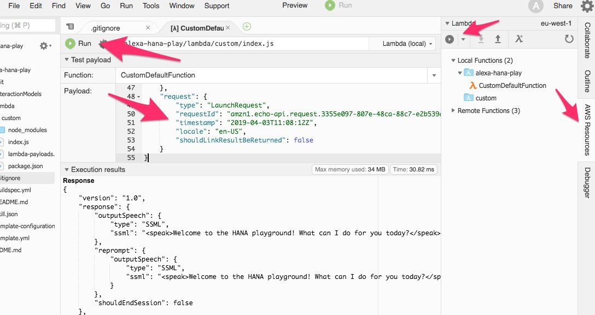

Push changes once again

```bash
$ git add *
$ git commit -m 'added local test & updated gitignore'
$ git push origin master
```

This concludes the section, you can now proceed!