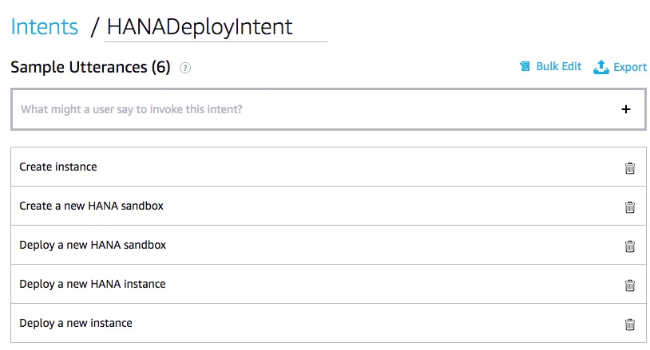
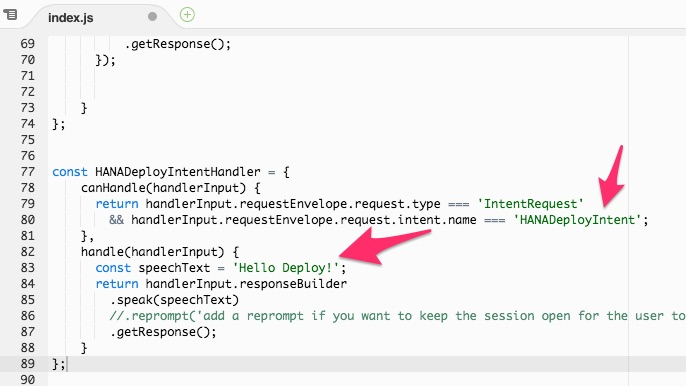

# 1. Run SAP HANA Quick Start

More Infos about the AWS Quick Start for SAP HANA can be found here  
https://docs.aws.amazon.com/quickstart/latest/sap-hana/welcome.html

## Prerequisites

- For ease of use - adjusted Codestar Role: arn:aws:iam::\<ID\>:role/CodeStar-\<projectID\>-Execution
- - Permission Boundary: Select AdministratorAccess
- - Permission: Select AdministratorAccess
- An existing EC2 Key Pair e.g. HANA_DEFAULT
- HANA Software Bundle in S3 Bucket -> s3://..., see [AWS SAP HANA Quick Start](https://docs.aws.amazon.com/quickstart/latest/sap-hana/step-3.html)

## Features

- Creates simple HANA sandbox environment including new VPC and default password
- default region / availability-zone eu-west1a (Ireland)
- Can determine Cloud Formation Status
- TODO: Sends mail upon completion

## Step 1 - Add Intents & Utterances

Open the Skillbuilder and go to the "Build" tab.  
Add a new intent “HANADeployIntent” as well as "HANAStatusIntent".  
Provide some utterances and for the HANADeployIntent tick the "Intent Confirmation" box. Add some confirmation text and save.




Click on "JSON Editor" and copy json payload to Cloud9. Replace contents of en_US.json, so that code repository is in sync!


## Step 2 - Add Handler 

In **index.js** create new handler for **HANADeployIntentHandler** and **HANAStatusIntentHandler** function and register it.  
Easiest way is to copy the **HelloWorldIntentHandler** code snippet and perform the changes, as shown below.




Push code to git and perform basic test.

## Step 3 - Add Dependency

Open the **package.json** file and add the dependency for the AWS SDK for nodejs = "aws-sdk": "^2.433.0"


Install dependencies for local testing via the console

```bash
$ cd lambda
$ cd custom
$ npm install
$ cd ..
$ cd ..
```

Test locally and push changes.

## Step 4 - Insert Quick Start Code

Create a new file called **hanaquickstart.js** in the lambda/custom directory.  
Copy & paste the contents of this [file hanaquickstart.js](hanaquickstart.js) and save.


Open the **index.js** file and add the following runtime dependecy on the very top

```javascript
const Alexa = require('ask-sdk-core');
//NEW:
var hanaquickstart = require("hanaquickstart");
```

Inside the **HANADeployIntentHandler** function, perform the following changes

```javascript
...
handle(handlerInput) 
{
    var promiseCF = hanaquickstart.createInstance();
        
    return promiseCF.then(speechText => {
        return handlerInput.responseBuilder
        .speak(speechText)
        //.reprompt('add a reprompt if you want to keep the session open for the user to respond')
        .getResponse();
    });
}
...
```

Perform the similar change for the **HANAStatusIntentHandler**. Desired method is "getStatus()".

Open the **hanaquickstart.js** and make desired changes. Especially adjust the **HANAInstallMedia** = S3 bucket URL, where the SAP HANA software should have been stored. Also check/edit again the **HANAMasterPass** and **KeyName**.


Run a local test, if successful commit and push. Test via Alexa Skill Simulator.