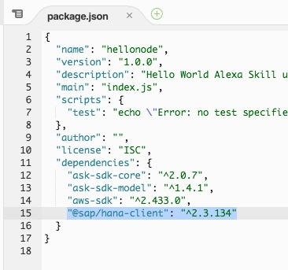
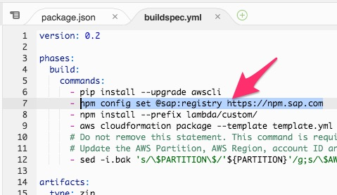

# 2. Fetch Data from SAP HANA

## Prerequisites

- HANA deployment either in same VPC like the lambda function or public IP / access
- HANA DB user & password
- HANA sample schema & table
- Codestar IAM Policy + Boundary (-> Policy Administrator)

## Step 1 - Add Intent & Utterances

Add Intent "HANARequestData" in Skillbuilder
Adjust utterances
Copy json to Cloud9

## Step 2 - Add Handler 

index.js + register

GIT push

test Lambda

## Step 3 - Add Dependency

Open the **package.json** file and add the dependency for the SAP HANA Client for nodejs = "@sap/hana-client": "^2.3.134"



Install dependencies for local testing via the console

```bash
$ cd lambda
$ cd custom
$ npm config set @sap:registry https://npm.sap.com
$ npm install
$ cd ..
$ cd ..
```

Open **buildspec.yml** file and add the respective registry setting to the build step
> npm config set @sap:registry https://npm.sap.com (https://npm.sap.com/)



Test locally and push changes.

## Step 4 - Provide Code

Add HANA Connection Code
Async Promise
Test