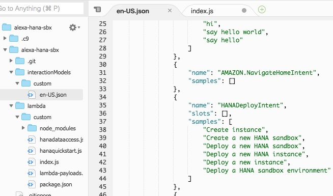

# 2. Fetch Data from SAP HANA

## Prerequisites

- HANA deployment either in same VPC like the lambda function or public IP / access
- HANA DB user & password
- HANA sample schema & table data e.g. https://blogs.sap.com/2018/12/18/howto-import-sflight-sample-data-into-sap-hana-from-a-local-computer/

## Step 1 - Add Intent & Utterances

Open the Skillbuilder and go to the "Build" tab.  
Add a new intent “HANAFetchDataIntent”. Provide some utterances and save the model.  


Click on "JSON Editor" and copy json payload to Cloud9. Replace contents of en_US.json, so that code repository is in sync!




## Step 2 - Add Handler 

In **index.js** create new handler for **HANAFetchDataIntentHandler** function and register it.  
Easiest way is to copy the **HelloWorldIntentHandler** code snippet and perform the changes, as shown below.

Create/Copy handler function


Register new handler function


Push code to git and perform basic test.

## Step 3 - Add Dependency

Open the **package.json** file and add the dependency for the SAP HANA Client for nodejs = "@sap/hana-client": "^2.3.134"


Install dependencies for local testing via the console

```bash
$ cd lambda
$ cd custom
$ npm config set @sap:registry https://npm.sap.com
$ npm install
$ cd ..
$ cd ..
```

Open **buildspec.yml** file and add the respective registry setting to the build step
> npm config set @sap:registry https://npm.sap.com


Test locally and push changes.

## Step 4 - Insert SAP HANA Client Code

Create a new file called **hanadataaccess.js** in the lambda/custom directory.  
Copy & paste the contents of [hanadataaccess.js](hanadataaccess.js) and save.


Open the **index.js** file and add the following runtime dependency on the very top

```javascript
const Alexa = require('ask-sdk-core');
//NEW:
var hanadataaccess = require("hanadataaccess");
```

Inside the **HANAFetchDataIntentHandler** function, perform the following changes

```javascript
...
handle(handlerInput) 
{
    var promise = hanadataaccess.test();
        
    return promise.then(speechText => {
        return handlerInput.responseBuilder
        .speak(speechText)
        //.reprompt('add a reprompt if you want to keep the session open for the user to respond')
        .getResponse();
    });
}
...
```

Make sure to check out the code inside **hanadataaccess.js**. 

> Note: Promises have been used, so that Alexa can wait for the SAP HANA Client API to respond! Furthermore, a timeout has been added, as Alexa requires a fast response! Especially adjust the **connectionParams** and **SQL**, so that the SAP HANA connection can be established and data can be retrieved.


Run a local test, if successful commit and push.  
Test via the Alexa Skill Simulator.