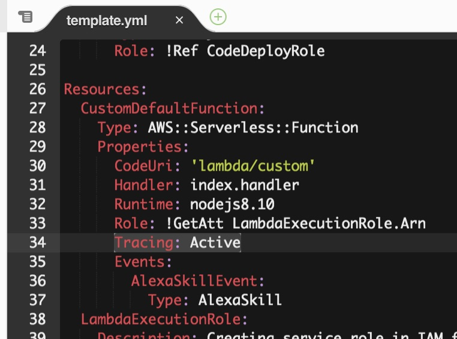
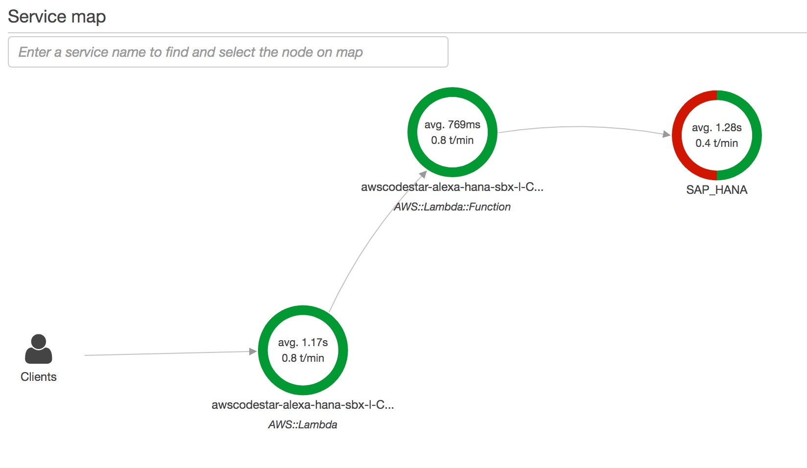

# 3. Bonus

## Add Lint to pipeline

See example [here](https://medium.com/the-node-js-collection/why-and-how-to-use-eslint-in-your-project-742d0bc61ed7)

## Add Unit Test to pipeline

See example [here](https://developer.amazon.com/de/blogs/alexa/post/35bdad3d-57c8-4623-88c6-815540697af5/unit-testing-create-functional-alexa-skills)

## Implement mail notification (AWS SES)

See example [here](http://www.wisdomofjim.com/blog/sending-an-email-from-aws-lambda-function-in-nodejs-with-aws-simple-email-service)

## Add XRAY / traceability

AWS X-Ray allows easy traceability throughout a serverless / microservice landscape.

In the template.yml enable XRAY monitoring:



In **index.js** add the following dependencies/lines, to enable the capture.

```javascript
//START XRAY
var AWSXRay = require('aws-xray-sdk-core');
var AWS = AWSXRay.captureAWS(require('aws-sdk'));
//END XRAY
```

In **hanadataaccess.js** add the custom trace / segment for SAP HANA:

```javascript
...
//START XRAY
var AWSXRay = require('aws-xray-sdk-core');
var Segment = AWSXRay.Segment;
//END XRAY
...
```

```javascript
...
//START XRAY
var parent = AWSXRay.getSegment();
var segment = new Segment('SAP_HANA', parent.trace_id, parent.id);
var subsegment = segment.addNewSubsegment("Connect");
//END XRAY

    connection.connect(connectionParams, (err) => {
        
        //START XRAY
        subsegment.close(err);
        segment.close(err);
        //END XRAY
    ...
```

The result should look like this

