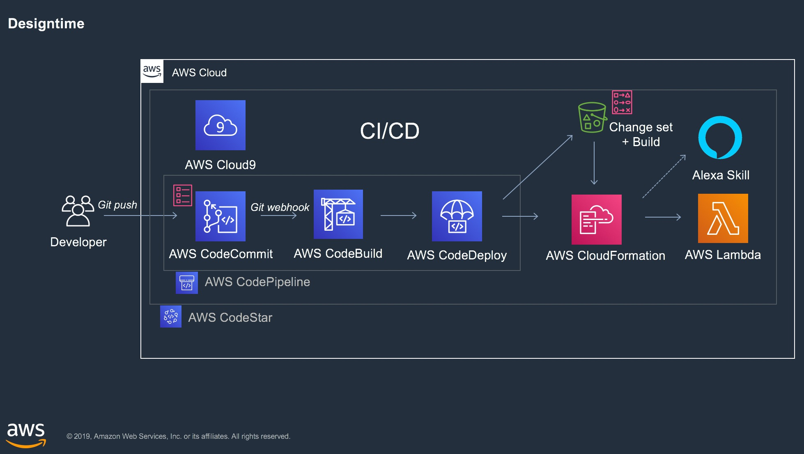
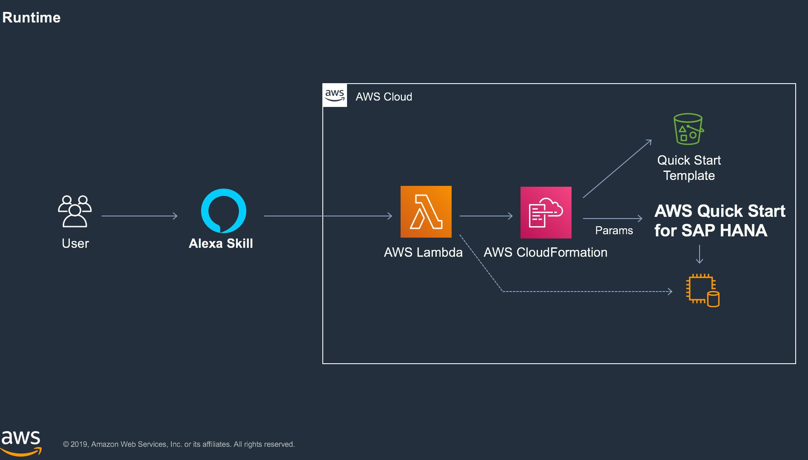

# aws-alexa-hana-playground

This repository is meant as guided walkthrough to create interactions between **Amazon Alexa** and **SAP HANA**.
It is divided into three parts

0. **Getting Started**: Prepares dev environment and introduces the hello world template including testing
1. **Run SAP HANA Quick Start**: Example on how to trigger AWS Cloud Formation scripts from alexa, in particular the SAP HANA Quick Start, creating a new SAP HANA sandbox on demand.
2. **Fetch Data from SAP HANA**: Example on how to fetch data from an existing SAP HANA database.
3. **Bonus**: Advanced tasks :)

## Covered Topics

- Being **Serverless** via AWS LAMBDA 
- **Continous Integration / Deployment** (CI/CD) via AWS Codestar, CodeCommit, CodeBuild, CodeDeploy, CodePipeline
- Skill development for **Amazon Alexa**
- **SAP HANA** Deployment and Integration
- **Infrastructure as Code / Automation** via AWS Cloud Formation and SAP HANA Quick Start

## Architecture

Developer Perspective

End User / Test Perspective

## License

